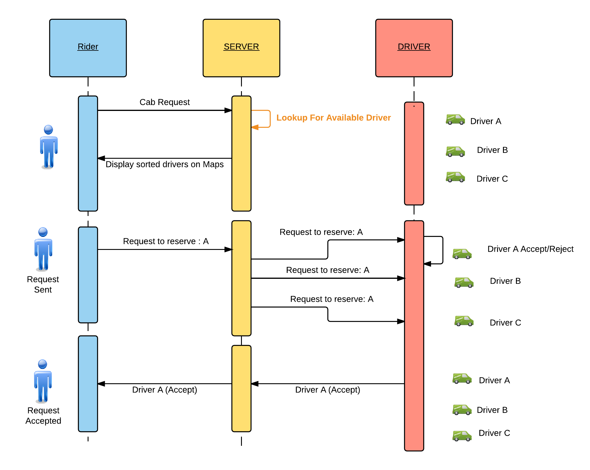

# codepath-uber-clone

A mini Uber clone representing a basic functinality of 
 - Registering as Driver
 - Registering as Rider

The application does following :
- Find nearest cabs/drivers who have registered themselves in the database
- Lets riders select the most nearest cab
- Lets drivers accept or reject the request from the rider

##Rider Registration
Rider registers himself with three values :
	- rider name
	- password

For simplicity, any rider is registered as rider, with duplicate rider name allowed.

The authentication is achieved to maintain the rider information in session.

##Driver Registration

Driver are registered with three values :

- cabId
- latitude
- longitide

Driver are not maintained in session

## Flow diagram

